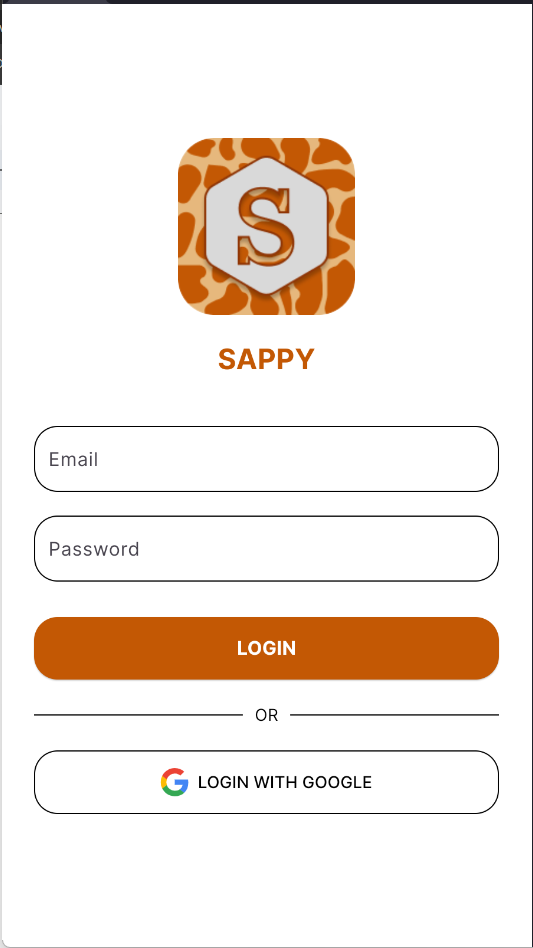
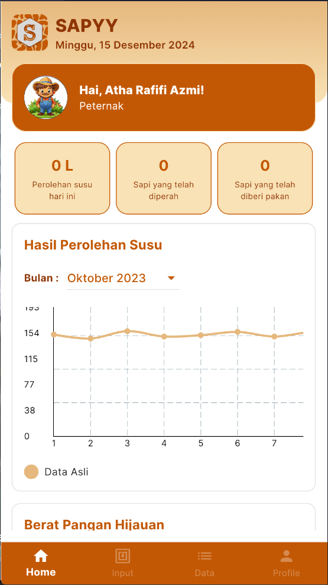
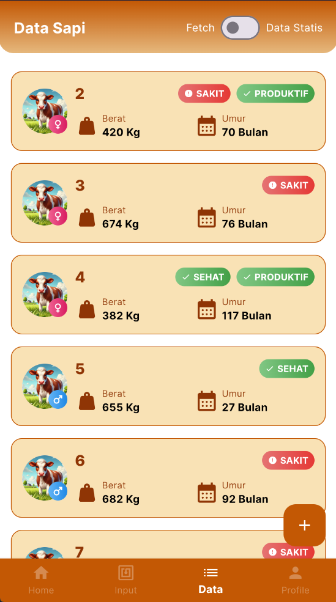
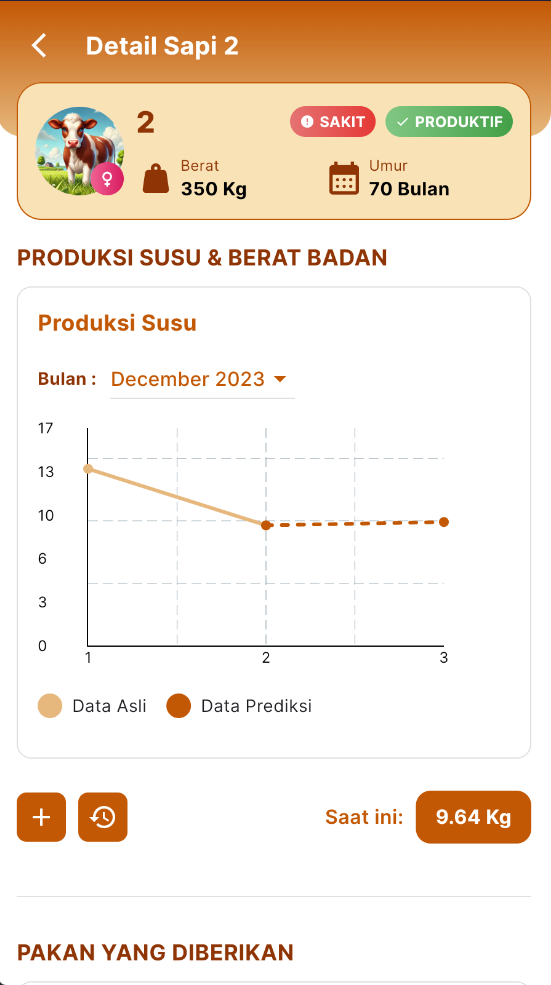
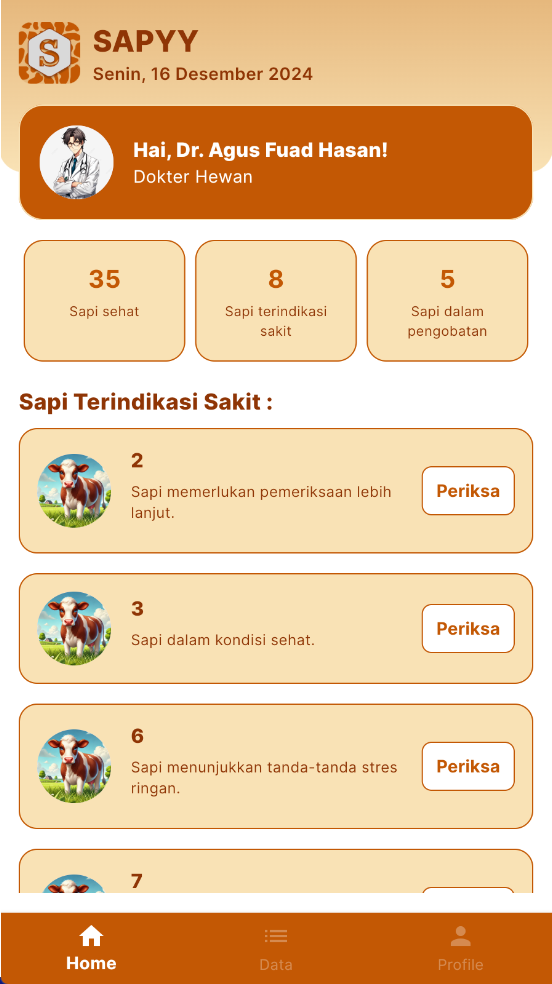
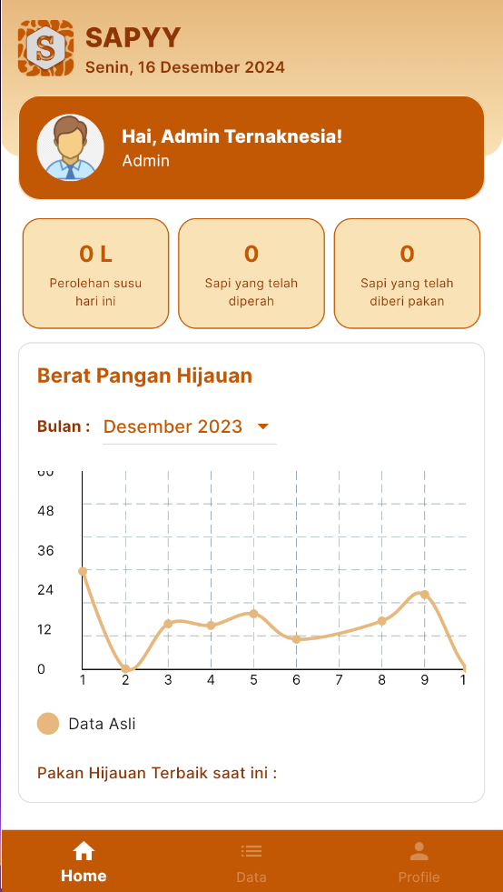
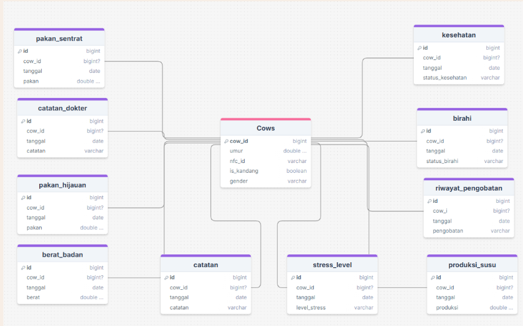

# 🐄 SAPPY: Aplikasi Manajemen Peternakan Sapi Perah Cerdas

   

**SAPPY** adalah solusi aplikasi mobile terintegrasi yang dirancang untuk membantu peternak sapi perah dalam mengatasi tantangan produktivitas. Proyek ini dikembangkan untuk PT. Ternaknesia Farm Inovation sebagai respons terhadap masalah penurunan produksi susu di Indonesia, meskipun populasi sapi terus meningkat
Aplikasi ini mengatasi masalah inti yaitu **kombinasi pakan yang tidak konsisten dan tidak terdata dengan baik**, yang menyulitkan pelacakan dan optimasi. Dengan SAPPY, peternak dapat mencatat, menganalisis, dan membuat keputusan berbasis data untuk meningkatkan produktivitas secara efisien

---

## 📸 User Interface & Design

Transformasi data peternakan ke dalam antarmuka mobile yang intuitif untuk berbagai peran pengguna.

### 1. Authentication & Farmer Experience
| Login Interface | Farmer Dashboard |
| :--- | :--- |
|  |  |
| *Sistem autentikasi aman dengan dukungan login konvensional maupun integrasi akun Google.* | *Dashboard utama peternak yang menyajikan statistik harian dan grafik tren produksi susu menggunakan fl_chart.* |

### 2. Monitoring & AI-Powered Insights
| Cow Data Inventory | AI Prediction Detail |
| :--- | :--- |
|  |  |
| *Manajemen profil sapi dengan indikator status kesehatan dan klasifikasi produktivitas secara real-time.* | *Visualisasi performa produksi susu yang membandingkan data aktual dengan prediksi model LSTM.* |

### 3. Professional Roles (Vet & Admin)
| Veterinarian Dashboard | Admin Central Overview |
| :--- | :--- |
|  |  |
| *Antarmuka khusus dokter hewan yang memprioritaskan daftar sapi dengan gejala klinis untuk penanganan cepat.* | *Panel kendali admin untuk memantau ketersediaan logistik pakan dan agregasi data seluruh peternakan.* |

---

## ✨ Fitur Utama

* 📱 **Pencatatan Data Komprehensif**: Mencatat berbagai data penting seperti kombinasi pakan harian (hijauan dan sentrat), produksi susu, berat badan, siklus birahi, riwayat kesehatan, dan catatan khusus untuk setiap sapi.
* 📈 **Visualisasi Data Interaktif**: Menampilkan data dalam bentuk grafik yang mudah dipahami, memungkinkan peternak memantau tren produksi susu dan perkembangan sapi dari waktu ke waktu.
* ⚡ **Integrasi NFC**: Mempermudah identifikasi dan input data sapi secara cepat dan akurat hanya dengan melakukan *scan* pada tag NFC yang terpasang pada sapi.
* 🧠 **Rekomendasi & Prediksi Berbasis AI**:
    * **Prediksi Produksi Susu**: Menggunakan model *Long Short-Term Memory (LSTM)* untuk memprediksi hasil susu di masa depan berdasarkan data historis.
    * **Optimasi Pakan**: Memberikan rekomendasi kombinasi pakan terbaik menggunakan model *Random Forest Regressor* untuk memaksimalkan produktivitas.
    * **Klasifikasi Produktivitas**: Mengklasifikasikan sapi secara otomatis sebagai "produktif" atau "tidak produktif" berdasarkan analisis data derivatif produksi susu harian.
* 👥 **Manajemen Multi-Peran**: Sistem mendukung tiga peran pengguna dengan hak akses yang berbeda: **Peternak**, **Admin**, dan **Dokter Hewan**, memastikan alur kerja yang terorganisir.

---

## 🏗️ Arsitektur Sistem

SAPPY dibangun di atas arsitektur **mikroservis** untuk memastikan skalabilitas, efisiensi, dan pemisahan tugas yang jelas. Sistem ini terdiri dari tiga komponen utama yang saling berkomunikasi.

1.  **Aplikasi Mobile (Flutter)**: Bertindak sebagai *frontend* yang digunakan oleh pengguna untuk berinteraksi dengan sistem.
2.  **API Gateway (Node.js & Express.js)**: Menjadi tulang punggung sistem yang menangani semua permintaan dari aplikasi, memproses logika bisnis, dan berkomunikasi dengan database serta layanan machine learning.
3.  **Layanan Machine Learning (Python & Flask)**: Sebuah mikroservis terpisah yang didedikasikan untuk melakukan komputasi AI yang kompleks seperti prediksi dan analisis data.
4.  **Database (PostgreSQL)**: Sistem manajemen basis data relasional yang menyimpan semua data peternakan secara terstruktur.

---

## 🛠️ Tech Stack

| Kategori | Teknologi |
| :--- | :--- |
| **Frontend (Mobile)** | `Flutter`, `Dart`, `Provider` (State Management), `http`, `fl_chart`, `nfc_manager` |
| **Backend (API)** | `Node.js`, `Express.js`, `Sequelize` (ORM) |
| **Machine Learning** | `Python`, `Flask`, `TensorFlow`, `Scikit-learn` (Random Forest) |
| **Database** | `PostgreSQL` |
| **DevOps & Tools** | `JSON Web Token (JWT)` (Authentication), `Figma` (UI/UX Design) |

---

## 🗄️ Desain Database

Database dirancang secara relasional menggunakan PostgreSQL. Inti dari desain ini adalah tabel `Cows` yang terhubung ke **sembilan tabel lain** melalui *foreign key* `cow_id`. Setiap tabel memiliki fokus spesifik untuk melacak semua aspek kehidupan sapi, mulai dari nutrisi, kesehatan, hingga produktivitas, memungkinkan analisis yang mendalam dan komprehensif.



*Diagram: Skema relasi database PostgreSQL.*

---

## 🚀 Menjalankan Aplikasi (Frontend)

Repositori ini berisi kode sumber untuk aplikasi mobile (frontend). Untuk menjalankannya:

1.  Pastikan Anda telah menginstal **Flutter SDK**.
2.  Clone repositori ini:
    ```bash
    git clone [https://github.com/azariafwn/Ternaknesia_SappyApp.git](https://github.com/azariafwn/Ternaknesia_SappyApp.git)
    ```
3.  Pindah ke direktori proyek:
    ```bash
    cd Ternaknesia_SappyApp
    ```
4.  Instal semua dependensi:
    ```bash
    flutter pub get
    ```
5.  Jalankan aplikasi pada emulator atau perangkat fisik:
    ```bash
    flutter run
    ```
*Catatan: Untuk fungsionalitas penuh, aplikasi ini memerlukan backend yang berjalan secara terpisah.*
